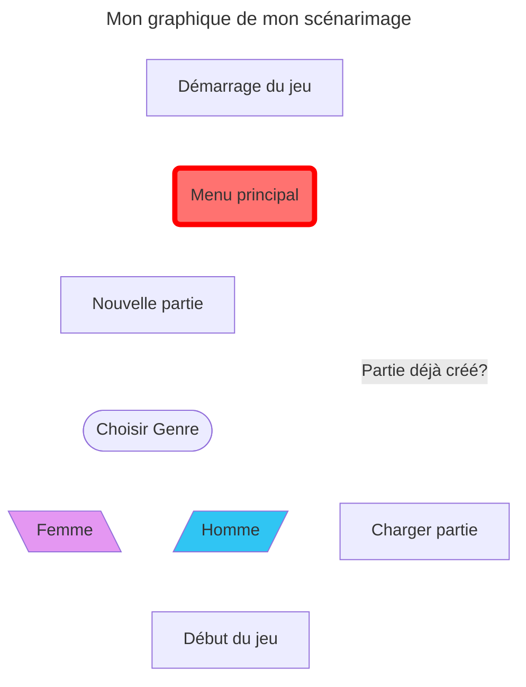

# Scénariser l'interactivité

## Idée

Mon idée de crée un **environnement** où le joueur a le choix de choisir son _genre_, chaque aurait leur propre système de jeu différent.
## Scénario

Dans un monde fantstique où les éléments (Terre, air, feu, eau) sont tous protégé par un **Gardien**. Mais suite à un événement mystérieux, l'équilibre de ces éléments sont instable et les Gardiens sont corrompu par une force obscure. Le joueur incarne un Gardien survivant qui doit restaurer l'harmonie. Le choix entre un personnage masculin et un personnage féminin influencerait le style de jeu et les interactions.

## Moodboard
!

## Technologie
La technologie qui sera utilisé serait principalement Unity.

