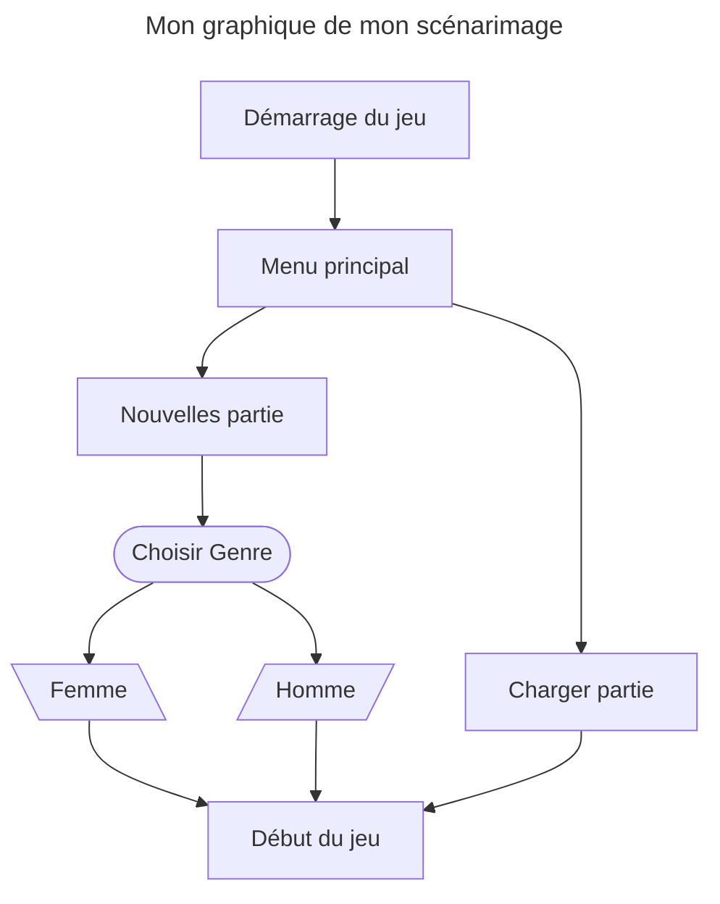

# Scénariser l'interactivité

## Idée

## Moodboard

## Technologie

```mermaid
---
title: Mon graphique de mon scénarimage
---
graph TD;
  markdown["Démarrage du jeu"]--> menu["Menu principal"];
  menu-->new["Nouvelles partie"];
  menu-->load["Charger partie"];
  new-->gender(["Choisir Genre"]);
  gender-->male[/Homme/];
  gender-->female[\Femme\];
  female-->start["Début du jeu"]
  male-->start
  load-->start
```

