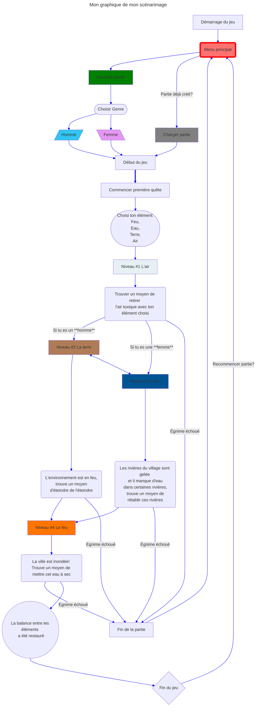
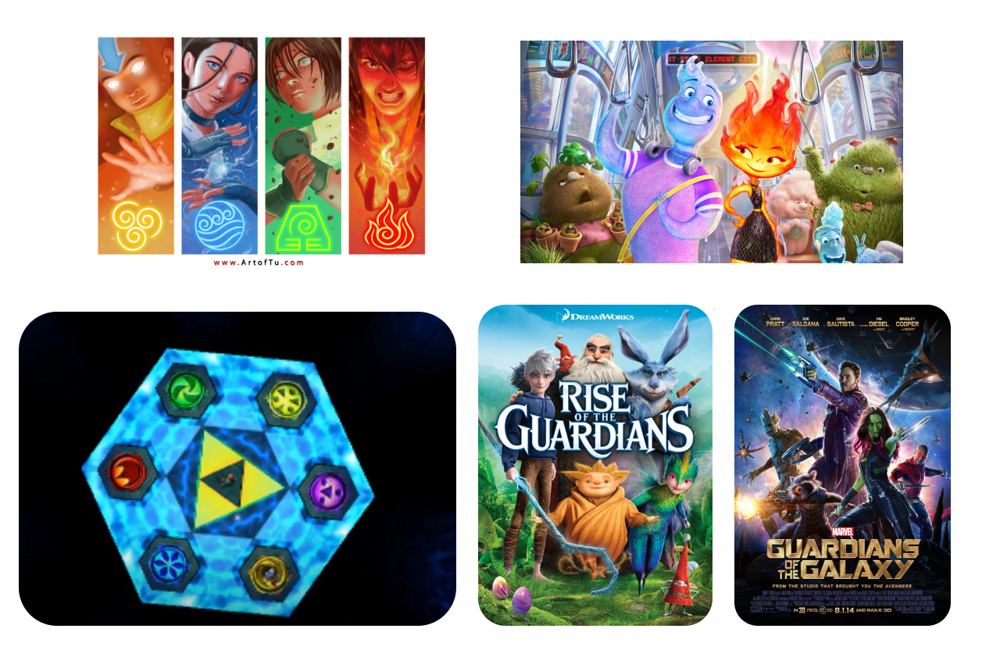
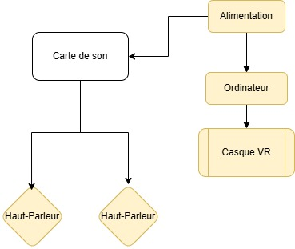
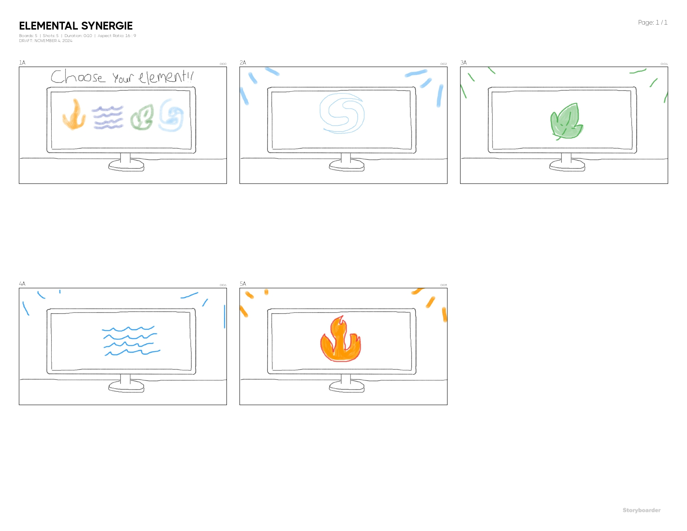

# Présentation d'une scénarisation d'un projet multimédia : Elemental Synergy

## Idée de l'oeuvre

L'idée derrière Elemental Synergy est de crée un **environnement** où le joueur a le choix de choisir l'élément qu'ils préfèrent. Chaque élément, qu'il s'agisse de l'eau, du feu, de la terre ou de l'air est doté de ses propres attributs uniques, comme l'ambiance par exemple. Dans cette univers fantaisique, les joueurs parcours différents biomes comportant au moins un casse-tête, chaqu'un ayant leur propre thème élémentaire. Le but étant de compléter ces casses-têtes pour avancer dans l'histoire du jeu. L'élément que le joueur a choisi lui donne des outils uniques pour résoudre ces casse-têtes.

### Scénario et expérience recherchée

Dans un monde fantstique où les éléments (Terre, air, feu, eau) sont tous protégé par un **Gardien**. Mais suite à un événement mystérieux, l'équilibre de ces éléments sont instable et les Gardiens sont corrompu par une force obscure. Le joueur incarne un Gardien survivant qui doit restaurer l'harmonie. Le choix l'eau, le feu, la terre et l'air influencerait le style de jeu et les interactions.

Le joueur démarre le jeu en découvrant un univers où un ambiance correspondant à l'élément se met à jouer. Le paysage, le UI, respectent aussi le thème de ces éléments. Tout devant compléter le casse-tête d'une différente manière selon l'élément qu'il a choisit.

# Graphique

# Conception

## Moodboard

## Technologie

La technologie qui sera utilisé:

- Unity pour le visuel.
- Reaper pour le son des éléments
- After Effect pour l'animation

### Matériel

- Speakers
- Tablette ou écran d'ordi

## Synoptique

## Planification

1. **Recherche et développement**
   - Analyser les attributs uniques de chaque élément.
   - Étudier des mécaniques de gameplay basées sur les éléments (ex : casse-têtes inspirés de la nature des éléments).

2. **Pré-production**
   - Conception des biomes pour chaque élément, en définissant leur ambiance visuelle et sonore.
   - Création de concept art et de maquettes pour visualiser les niveaux.
   - Développement du scénario et des dialogues.

3. **Production**
   - **Graphisme** : Création des textures et modèles 3D pour les biomes et Gardiens.
   - **Audio** : Enregistrement des sons d'ambiance pour chaque élément avec Reaper.
   - **Programmation** : Intégration des mécaniques de jeu dans Unity et gestion des interactions selon l'élément sélectionné.

4. **Post-production**
   - Tests et débogage pour assurer une expérience de jeu fluide.
   - Ajustements finaux sur les animations (After Effects) et les effets sonores.
   - Préparation de la documentation finale pour le projet.

## Simulation
L'expérience de jeu commence dans un environnement correspondant à l'élément choisi. Le joueur peut explorer différents biomes et interagir avec l’environnement et les casses-têtes. La résolution de chaque casse-tête permettra au joueur de progresser vers le prochain Gardien corrompu, restaurer l'harmonie et avancer dans l'histoire.

## Scénarimage
Chaque élément dispose d'une série de scènes structurées ainsi :

## Identification des ressources humaines disponibles
1. Game Designer
   - Responsable de la conception du gameplay et des mécaniques basées sur chaque élément.
   - Création de casse-têtes adaptés à chaque élément.
   - Gestion des tests de gameplay pour assurer une expérience fluide.
2. Développeur Unity
   - Connaissance approfondie d’Unity et des configurations VR.
   - Capacité à coder les interactions et les logiques de jeu pour chaque élément.
   - Optimisation des performances VR et intégration des modèles 3D.
3. Artiste 3D
   - Création des modèles, textures et environnements pour chaque biome élémentaire.
4. Animateur / Motion Designer
   - Création d’effets visuels et transitions entre biomes avec After Effects.
5. Sound Designer
   - Enregistrement et édition des sons d'ambiance pour chaque élément avec Reaper.
6. Scénariste / Concepteur Narratif
   - Écriture de l’histoire, des dialogues et des descriptions de quêtes.
   - Travail avec le game designer pour intégrer les éléments narratifs aux casse-têtes.

## Devis Technique
### Logiciels

| Type de logiciel        | Description                                      |
|-------------------------|--------------------------------------------------|
| **Moteur de jeu**      | Unity pour le développement et l’optimisation VR. |
| **Logiciel audio**      | Reaper pour la création et l’édition des sons d'ambiance et effets sonores. |
| **Animation et effets** | After Effects pour les animations visuelles (transitions entre les éléments). |

### Matériel

| Type de matériel        | Quantité | Description                             |
|-------------------------|----------|-----------------------------------------|
| **Haut-parleurs**       | 4        | Pour les tests d’immersion sonore.     |
| **Carte de son**       | 1        | Pour transmettre le son aux speakers     |
| **Tablette ou écran**   | 1        | Pour la gestion des assets et le développement. |
| **Ordinateur**           | 1        | Pour l'expérience visuelle immersive.  |

## Inventaire Multimédia

| Type         | Description                               | Logiciel        |
|--------------|-------------------------------------------|-----------------|
| **Visuel**   | Modèles 3D, textures des biomes, UI       | Unity          |
| **Audio**    | Sons d'ambiance, effets sonores, musique  | Reaper         |
| **Audio**    | Ambiance, immerssion  | QLC         |
| **Animation**| Transitions et effets visuels             | After Effects  |
| **Texte**    | Scénario, dialogues et instructions       | Notepad++, Unity |
| **UI**       | Icônes, menus adaptés aux éléments        | Unity          |

---

**Auteur** : _Pierre-Luc Proulx_

---
