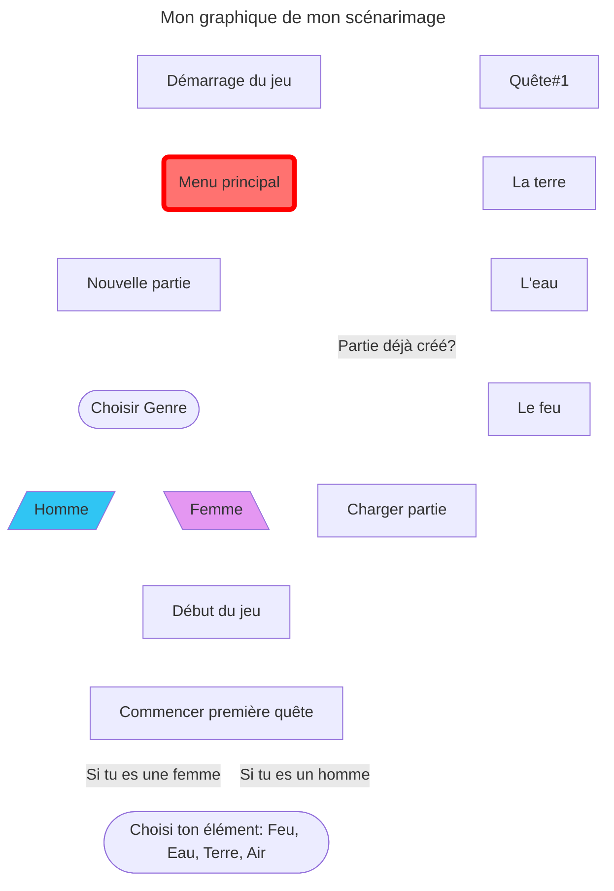

# Présentation d'une scénarisation d'un projet multimédia : Elemental Synergy

## Idée de l'oeuvre

L'idée derrière Elemental Synergy est de crée un **environnement** où le joueur a le choix de choisir l'élément qu'ils préfèrent, chaqu'un éléments auraient leur propre attribut différent.

## Scénario

Dans un monde fantstique où les éléments (Terre, air, feu, eau) sont tous protégé par un **Gardien**. Mais suite à un événement mystérieux, l'équilibre de ces éléments sont instable et les Gardiens sont corrompu par une force obscure. Le joueur incarne un Gardien survivant qui doit restaurer l'harmonie. Le choix l'eau, le feu, la terre et l'air influencerait le style de jeu et les interactions.

Le jeu étant constitué de 4 niveaux différents, dont ces niveaux représentront un égnigme pour chaque éléments.

# Conception

## Moodboard

## Technologie

La technologie qui sera utilisé:

- Unity pour le visuel.
- Reaper pour le son des éléments
