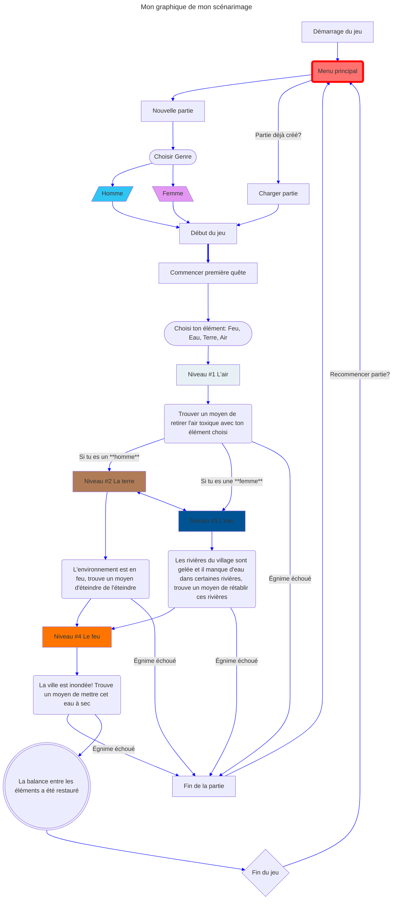

# Présentation d'une scénarisation d'un projet multimédia : Elemental Synergy

## Idée de l'oeuvre

L'idée derrière Elemental Synergy est de crée un **environnement** où le joueur a le choix de choisir l'élément qu'ils préfèrent. Chaque élément, qu'il s'agisse de l'eau, du feu, de la terre ou de l'air est doté de ses propres attributs uniques, comme l'ambiance par exemple. Dans cette univers fantaisique, les joueurs parcours différents biomes comportant au moins un casse-tête, chaqu'un ayant leur propre thème élémentaire. Le but étant de compléter ces casses-têtes pour avancer dans l'histoire du jeu. L'élément que le joueur a choisi lui donne des outils uniques pour résoudre ces casse-têtes.

## Scénario et expérience recherchée

Dans un monde fantstique où les éléments (Terre, air, feu, eau) sont tous protégé par un **Gardien**. Mais suite à un événement mystérieux, l'équilibre de ces éléments sont instable et les Gardiens sont corrompu par une force obscure. Le joueur incarne un Gardien survivant qui doit restaurer l'harmonie. Le choix l'eau, le feu, la terre et l'air influencerait le style de jeu et les interactions.

Le joueur démarre le jeu en découvrant un univers où un ambiance correspondant à l'élément se met à jouer. Le paysage, le UI, respectent aussi le thème de ces éléments. Tout devant compléter le casse-tête d'une différente manière selon l'élément qu'il a choisit.

# Graphique

# Conception

## Moodboard

## Technologie

La technologie qui sera utilisé:

- Unity pour le visuel.
- Reaper pour le son des éléments
- After Effect pour l'animation
