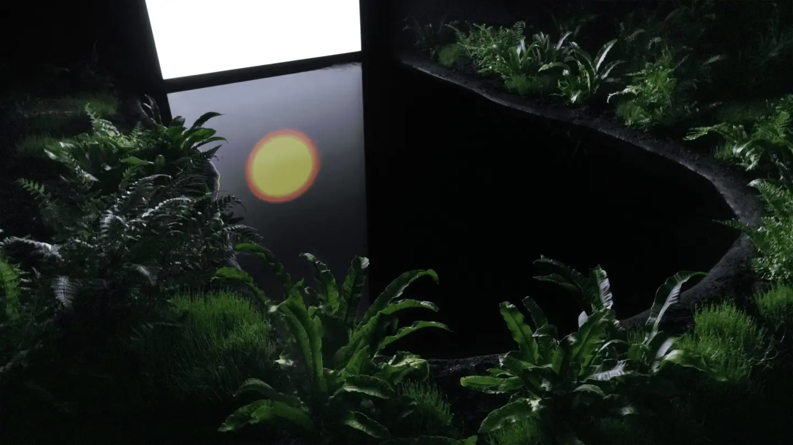

# Sun Rise Set
modèle de page docsify pour une publication via page sans actions 
> Travail par : Pierre-Luc Proulx

[Sun Rise Set Démonstration](https://village-numerique.mutek.org/fr/installations/set-rise-sun-par-cinzia-campolese)


---

## Créateur/créatrice
| Cinzia Campolese | Qui-est-ce? |
|------------------| ----------- |
|  | Cinzia Campolese est une artiste qui vit et travaille à Montréal (Canada). Ses œuvres ont été exposées dans des institutions culturelles, des galeries et des événements tels que Stereolux, Biennale Chroniques et Biennale Nova XX, Mutek Montréal et Biela Noc. |

* Formation: Italie
* Partenaires:
   -  Conseil des arts du Canada
   -  MT LAB
   -  Tourisme Montréal
   -  Place des Arts
   -  UQÀM
   -  Quartier de spectacles Montréal
   -  La Presse
   -  Gouvernement du Québec
   -  La ville de Montréal

## Quand ?
* Installé en 2024
*
 Matérielles présentées en première en 2023 à NEW NOW Festival[^1].
## Où ?


* Adresse: 
```
1 Boulevard Maisonneuve Ouest,
Montréal
H2X 0E3
```

* Lieu d'exposition: Laurent & Clark 
(intérieur)
* Station Place des Arts

## Hein? C'est quoi ça?

**Set-Rise-Sun** est une installation multimédia innovante qui interroge notre relation avec le temps et l'environnement à l'ère numérique. L'œuvre se compose d'un écran *LCD* modifié, disposé perpendiculairement à une surface d'eau dans un cadre naturel. De l'oeil nue, l'écran émite seulement une lumière blanche. Le contenu n'est visible qu'à travers la réflexion sur l'eau qui agit comme un filtre polarisant naturel en raison du phénomène d'angle de Brewster.

 
[Vidéo de l'oeuvre](https://vimeo.com/841972415)


*Format: Installation audiovisuelle 

### Objectif
À travers cette juxtaposition de technologie et de phénomènes naturels, l'artiste invite à réfléchir sur plusieurs thèmes : - la perception du temps; 
- l'interaction homme-nature, 
- la dépendance technologique
- la révélation par la nature.

### Public ciblé
Cette oeuvre offre une expérience contemplative qui encourage le public à reconsidérer son rapport au temps, à la technologie et à l'environnement naturel, tout en mettant en lumière les défis socio-environnementaux de notre époque.

*Capacité: <sup>10</sup> personnes

## Comment 
Technique : 
*Écran LCD 86” modifié (avec filtre), 
*Bassin d'eau personnalisé 
*Terre et plantes (variables)
*Lecteur multimédia

## Appréciation et commentaire personnel

Personellement j'ai bien apprécié l'oeuvre, je l'ai trouvé agréable. Mon expérience à été enrichie par une découverte innattendue: grâce à mes lunettes de soleil, j'ai pu remarquer un détail qui est facile à manquer, un détail qui échappait à l'oeil nu. Cette découverte m'a permis de percevoir une variation dans ce que l'on voyait à travers le filtre, sans l'aide des lunettes ce détail n'est juste pas visible. C'est une observation a approfondi mon appréciation de l'oeuvre.

[^1]: Festival d'art digital qui a lieu en Europe


